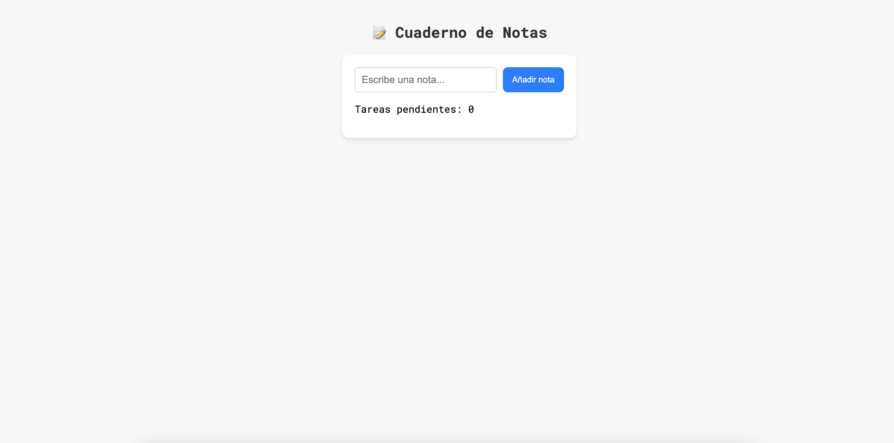
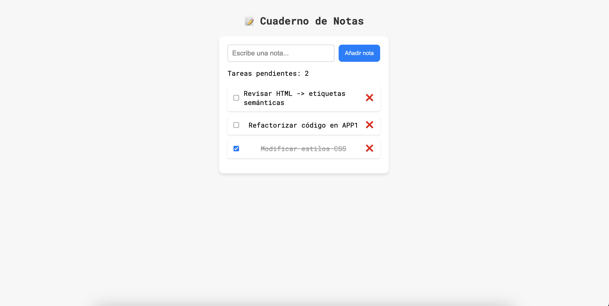

# 📝 Cuaderno de Notas

Una sencilla aplicación de notas creada con **React**, que permite añadir, tachar, editar y eliminar tareas. Las notas se guardan en el **localStorage** del navegador, por lo que no se pierden al recargar la página.

## ✨ Funcionalidades

- ✅ Añadir tareas
- 📝 Editar tareas con doble clic (si no están completadas)
- ☑️ Marcar tareas como completadas (con tachado automático)
- 🗑️ Eliminar tareas
- 🔄 Guardado automático en `localStorage`
- 📊 Contador de tareas pendientes

## 🎆 Imágenes

Pantalla inicial:


Pantalla con notas:



---

## 🚀 Instalación

1. Clona el repositorio:

```bash
git clone https://github.com/albahdezs/cuaderno-de-notas.git
cd nombre-del-repo
```

2. Instala dependencias:

```bash
npm install
```

3. Inicia la aplicación:
```bash
npm start
```
Se abrirá en http://localhost:3000

---

## 🛠 Tecnologías utilizadas

- React
- HTML & CSS
- LocalStorage

---

## 📬 Contacto

Created by [@Albahdezs](https://github.com/Albahdezs) – feel free to reach out!
